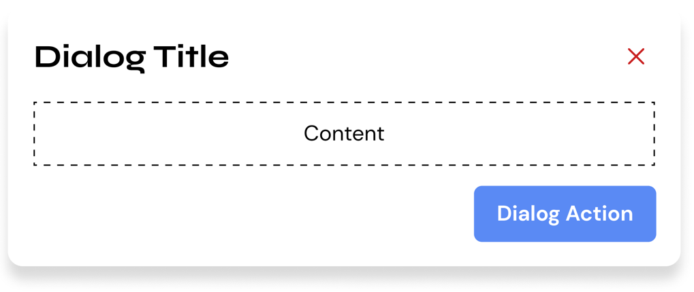

## Dialog Header
The dialog header contains all the titular information of the dialog. It serves as a hook for the user. It should display necessary (but not deep) information.

The order of information is as follows:
1. Dialog Title - A simple and short headline.
2. Dialog Subtitle - Short additional, but still relevant information.
3. Dialog Image (Optional) - Main media for the dialog.
4. Dialog Icon (Optional) - Small media for the dialog.

## Dialog Content
The dialog is a blank surface component, technically you can put anything in there. However, all the content inside the dialog **should not** overflow the container.

You cannot also put too many contents inside a dialog. We generally put the limit at about 2 components (regardless of size).

## Dialog Actions
Dialog actions allows a user to perform an action related to the dialog. Dialog actions use the [Hashi button component](button.mdx).

We have certain guidelines on how to use Dialog actions. First, all actions must be unique in terms of priority, meaning
you can't have two buttons that have the top priority. Button priority is indicated through its style. Button priority
information and guidelines can be found in the [button variants section](button.mdx#button-variants) of the button
documentation.

Second, the priority hierarchy direction flows from left to right (left being the most prioritized, right being the
least prioritized)

1. As you can see, the primary (top priority) action in this context is on the left side
2. While the secondary (least priority) action is on the right.